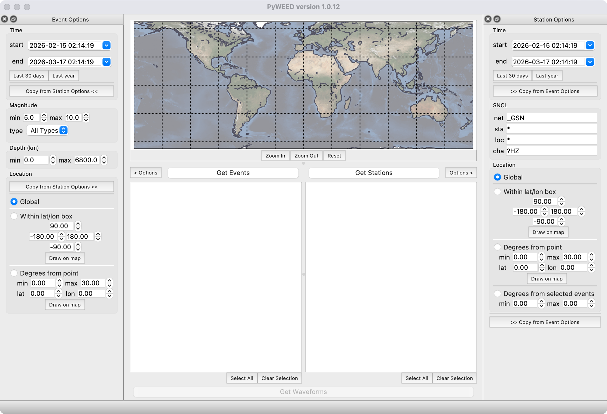
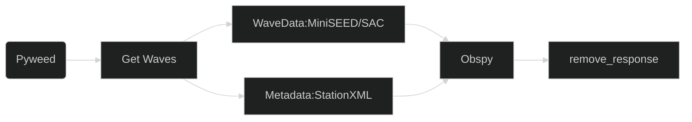

南京大学行星科学行星固体物理作业

# 环境配置

```bash
# 创建并直接安装核心地震学库 ObsPy
conda create -n seis -c conda-forge obspy jupyter numpy pandas matplotlib setuptools cartopy pyGMT
# 激活环境
conda activate seis
# 退出环境
conda deactivate
# 检查环境
conda env list
#检查库
conda list
```

# 地震数据可视化

[PyWEED](https://iris-edu.github.io/pyweed/)



下载方式参考网站

```
conda activate pyweed
(pyweed) pyweed

```

# 地震学学习网站

[学](https://seismo-learn-website.readthedocs.io/en/latest/)


# 数据工作流


